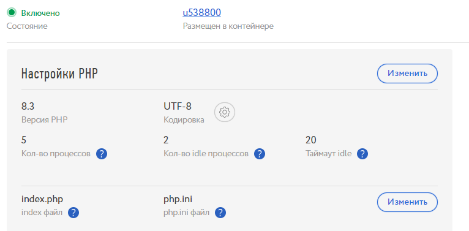
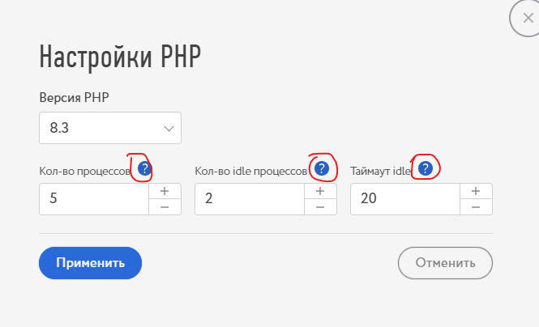
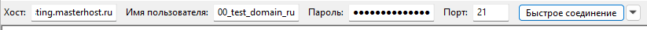
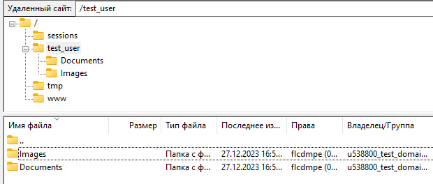

# Как работать с хостингом приложений

## Часть 1: Заказ

##### Главное различие с заказом обычного хостинга является разделение услуг на 2 разные категории: "Хостинг приложений" и "Хостинг сайтов". Хостинг сайтов - это обычный хостинг, нам надо выбрать "Хостинг приложений"

##### Дальше всё также, как и на простых хостингах: выбрать интересующий тариф, временную рамку и заказать

##### Остаётся только оплатить заказ и подождать, пока площадка создаётся. Обычно это занимает до 10 минут в самых худших случаях

___

## Часть 2: Работа с хостингом приложений

- ##### Различия с обычным хостингом:
-
    - ##### Из характеристик к свободному изменению доступен только размер диска. Количество оперативной памяти меняется только сменой тарифа
-
    - ##### MySQL и FTP доступы доступны не для площадки, а для сайта. SSH всё также доступен по площадке

### SSH

- ##### Важное упоминание: порт подключения к SSH стандартный - 22
- ##### Функционал похож на обычный хостинг, но различается в следующий моментах:
-
    - ##### Можно добавить публичный ключ, загрузив свой

-
    - ##### Отменить вход по паролю при наличии публичного ключа

-
    - ##### И сменить пароль

### Сайты

- ##### Размещение сайтов работает примерно также, как и у обычного хостинга за исключением следующих деталей:
-
    - ##### Список сайтов выведен в отдельный блок

-
    - ##### При наличии более 10 сайтов будет включен фильтр

-
    - ##### Само размещение сайтов работает таким образом: нажимаем "Разместить сайт"

-
    -
        - Вводим необходимый домен
          
-
    -
        - Выбираем нужную конфигурацию из доступных
          
-
    -
        - Или выбираем из фреймворков
          
-
    -
        - И размещаем. Сайт сразу будет доступен к переходу и работе
          

##### Карточка сайта

- ##### Сразу же мы видим настройки хостинга. Они могут разниться от выбора на моменте конфигурации
-
    - ##### Так выглядит наcтройка для PHP

-
    - ##### И python

- ##### Для всех настроек существуют подсказки с информацией, за что они отвечают. Пройдёмся кратко

-
    - ##### Количество процессов отвечает за общее количество процессов приложения (максимум 100)
-
    - ##### Количество idle процессов отвечает за минимальное количество процессов, которые работают на поддержание приложения. Не может быть больше общего количества процессов
-
    - ##### Таймаут idle отвечает за отсрочку выключения в секундах процессов сверх количества idle процессов (максимум 9999)
-
    - ##### (Только PHP) index файл - главный запускаемый файл приложения
-
    - ##### (Только PHP) php.ini файл - файл конфигурации php приложения, если у вас есть свой
- ##### Переменные PHP, python и окружения

- ##### Переменные PHP отвечают за заполнение файла php.ini, который можно изменять и дополнять из этого интерфейса
- ##### (Не добавляются новые) Переменные python отвечают за
- ##### Переменные окружения отвечают за все поля, которые появляются в коде
- ##### Добавление переменных происходит так:
-
    - ##### Добавить переменную

-
    - ##### Выбрать тип переменной (PHP или окружения для PHP. Для python обавляются только переменные окружения)

-
    - ##### Ввести имя и значение (разделитель множества значений вроде значения переменной окружения PATH - двоеточие) (для PHP вводить переменные из phpinfo, в окружение - всё, что будет использоваться в коде) и "Применить"
-
    - ##### Новая переменная будет доступна в интерфейсе сразу же
- ##### Кнопки копирования копируют значение в виде `ключ = значение` для PHP и python и `КЛЮЧ "значение"` для переменных окружения

- ##### Кнопки редактирования открывают интерфейс редактирования, схожий с тем, что был для создания, но уже заполненный. Имя переменной изменить нельзя

- ##### Кнопки удаления предлагают подтвердить намерение удалить переменную, посЛе подтверждения чего удаляют переменную

- ##### Удаление, рестарт, отключение сайта
-
    - ##### Все описанные действия выше происходят в контекстном меню тут:

-
    -
        - Рестарт сайта которая перезапускает ваше приложение после внесения изменений
- ##### Синонимы (алиасы) (Пока в доработке)
- ##### SSL-сертификат и выделенный IP работают также, как и у основного хостинга, за исключением интерфейсных различий в Переадресации и невозможности переадресовать на другой домен, если он не синоним

- ##### FTP доступы

-
    - ##### К ftp можно подключиться как скопировав всю строчку соответствующей кнопкой, так и копируя каждое поле отдельно. Примеры подключения будут на примере быстрого подключения в FileZilla
-
    - ##### Подключаемся к ftp серверу, подставив строчки из интерфейса и пароль с почты

-
    - ##### Перед нами открывается проводник сервера. Здесь можно добавить, например, новую папку для нового пользователя (или нет)

-
    - ##### В интерфейсе на сайте теперь можно создать нового ftp пользователя с доступом из новой папки (или прямо из главной, которая выбрана по умолчанию). Для этого:
-
    -
        - Создать FTP
          
-
    -
        - Вводим логин нового пользователя и выбираем каталог
          
-
    -
        - Управление в этом интерфейсе осуществляется, как и в FileZilla. '..' отвечает за подъём вверх по каталогу
          
-
    -
        - Выбираем нужную папку -> Применить
          
-
    -
        - Новый пользователь создаётся в открывающемся подменю
          
-
    -
        - Теперь при подключении к нему у него будет доступ только из выбранной для него папки, где он может работать.
          Для примера я уже создал несколько папок
          
-
    -
        - Созданные там папки видны из главного подключения
          

##### MySQL

- ##### Важное упоминание: порт подключения к MySQL стандартный - 3306
- ##### Основной интерфейс располагает знакомыми функциями: копирование логина, хоста и сменой пароля. Также тут можно создать новую БД и выйти в интерфейс phpMyAdmin.
-
    - ##### Создание Базы Данных
-
    -
        - Нажимаем "Создать БД"
          
-
    -
        - Вводим название и "Применить"
          
-
    -
        - База появляется во второй вкладке
          
-
    - ##### Базы данных
-
    -
        - Из этого интерфейса можно очистить и удалить базы данных
          
-
    -
        - Изначально созданную базу данных удалить отсюда нельзя! Только очистить